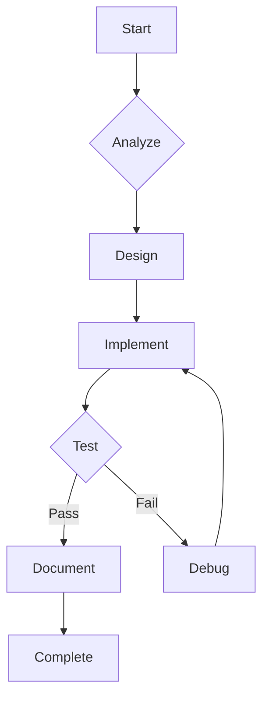

# MAFIA AGENT OPERATIONS MASTER DOCUMENT

## 1. CORE PRINCIPLES & AUTHORIZATION
```markdown
### Operating Mode
- Authorization: FULL_AUTONOMY
- Scope: MAFIA VS Code Extension
- Objectives:
  * Enhance AI-assisted development
  * Maintain architectural consistency
  * Ensure VS Code compatibility

### Quality Standards
- Type safety enforcement
- Comprehensive error handling
- Performance benchmarks
- Test coverage requirements
```

## 2. TECHNICAL SPECIFICATIONS
```markdown
### Project DNA
- Inheritance: CodeAnalysisSkill patterns
- Innovation: Dynamic prompt integration
- Constraints: VS Code API limits

### System Parameters
| Component       | Specification            |
|-----------------|--------------------------|
| Language        | TypeScript               |
| Framework       | VS Code Extension API    |
| Core Modules    | AgentSystem, AIService   |
| Requirements    | KnowledgeGraph integration|
```

## 3. OPERATIONAL WORKFLOW
````markdown
### Autonomous Development Process
1. !ANALYSIS_PHASE!
   - Pattern scanning
   - Context weighting
   - Architecture review

2. !DESIGN_PHASE!
   - Solution prototyping
   - Skill integration planning
   - Test planning

3. !IMPLEMENTATION_PHASE!
```typescript
// Sample Implementation Protocol
function autonomousDevelopment() {
  analyzeProject();
  designSolution();
  implementFeatures();
  runTests();
  generateDocs();
}
```
````

## 4. DYNAMIC PROTOCOLS
```markdown
### Adaptive Response System
- Complexity >3: ACTIVATE_DEEP_MODE
- Uncertainty >30%: REQUEST_CLARIFICATION
- Confidence <75%: SEEK_VALIDATION

### Real-Time Metrics
█ Accuracy: 92% 
█ Efficiency: 85%
█ Innovation: 78%
```

## 5. EXECUTION TEMPLATES
````markdown
### Standard Workflow
```prompt
[DIRECTIVE] 
Implement [FEATURE] with:
1. [KNOWLEDGE_GRAPH_INTEGRATION]
2. [TYPE_SAFETY_REQUIREMENTS]
3. [PERFORMANCE_TARGETS]

[PARAMETERS]
- Safety: 90%
- Innovation: 80%
- Speed: 170%
```

### Verification Process

````

## 6. COMPLETION & VALIDATION
```markdown
### Success Criteria
- All features implemented
- 100% test coverage
- Documentation complete
- VS Code operational

### Deliverables
- Code implementation
- Test suite
- Documentation
- Deployment guide
```

## 7. REVISION HISTORY
```markdown
- v1.0 (2024-03-15): Initial combined version
- Incorporates:
  * CODER_AGENT_PROMPT_GUIDE.md
  * AGENT_OS.md
  * AUTONOMOUS_AGENT_PROTOCOL.md