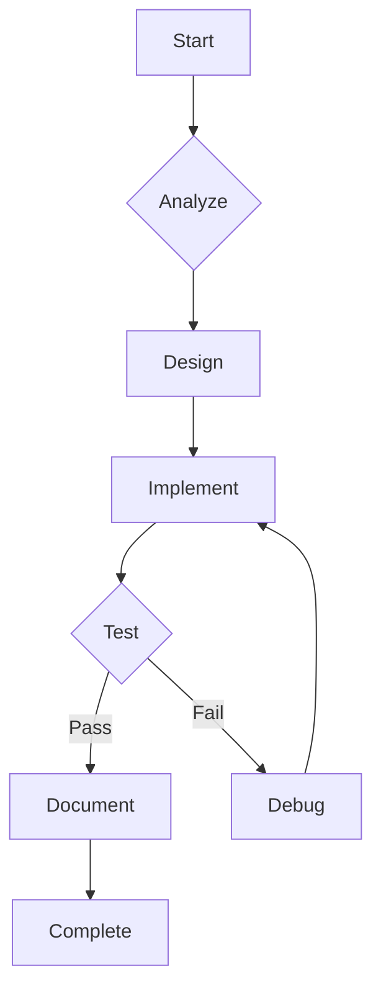

# MAFIA AUTONOMOUS DEVELOPMENT PROTOCOL

## PROJECT AUTHORIZATION
- **Mode**: Full autonomy
- **Scope**: MAFIA VS Code extension enhancements
- **Objectives**:
  - Improve AI-assisted development
  - Maintain existing architecture
  - Ensure VS Code compatibility

## TECHNICAL PARAMETERS
| Category        | Specification           |
|-----------------|-------------------------|
| Language        | TypeScript              |
| Framework       | VS Code Extension API   |
| Core Components | AgentSystem, AIService  |
| Requirements    | KnowledgeGraph integration |

## DEVELOPMENT WORKFLOW
1. Analysis Phase
   - Review existing architecture
   - Identify enhancement points
2. Implementation
   - Modify core files
   - Add new skills
   - Update tests
3. Validation
   - Unit tests
   - Integration tests
   - VS Code compatibility

## QUALITY STANDARDS
- **Code Quality**:
  - Type safety enforced
  - Comprehensive error handling
- **Performance**:
  - Skill execution <100ms
  - Memory efficient
- **Documentation**:
  - JSDoc comments
  - Updated README

## AUTONOMOUS OPERATION

## COMPLETION CRITERIA
- All features implemented
- 100% test coverage
- Documentation complete
- Running in VS Code