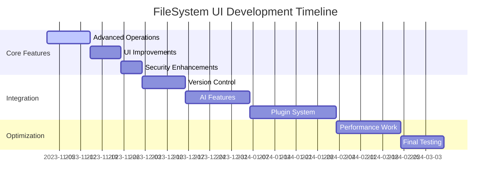

# Next Development Phases

## Phase 1: Enhanced FileSystem Features
1. **Advanced File Operations**
   - Copy/move operations
   - File watching/change detection
   - Bulk operations

2. **UI Improvements**
   - File tree browser component
   - Drag-and-drop support
   - Multi-selection operations

3. **Security Enhancements**
   - Sandboxed file access
   - Permission system
   - Operation validation

## Phase 2: Integration Features
1. **Version Control**
   - Git integration
   - Change diff visualization
   - Commit management

2. **AI-Assisted Operations**
   - Smart file organization
   - Content analysis
   - Auto-categorization

3. **Plugin System**
   - Custom operation hooks
   - Third-party integrations
   - Extensible UI components

## Phase 3: Performance Optimization
1. **Large File Handling**
   - Streaming support
   - Progress indicators
   - Memory management

2. **Caching System**
   - File metadata cache
   - Operation memoization
   - Smart refresh

3. **Bundle Optimization**
   - Webpack configuration
   - Lazy loading
   - Tree shaking

## Development Roadmap

## Immediate Next Steps
1. Implement file tree browser component
2. Add copy/move operation support
3. Develop sandboxed file access system
4. Create Git integration prototype